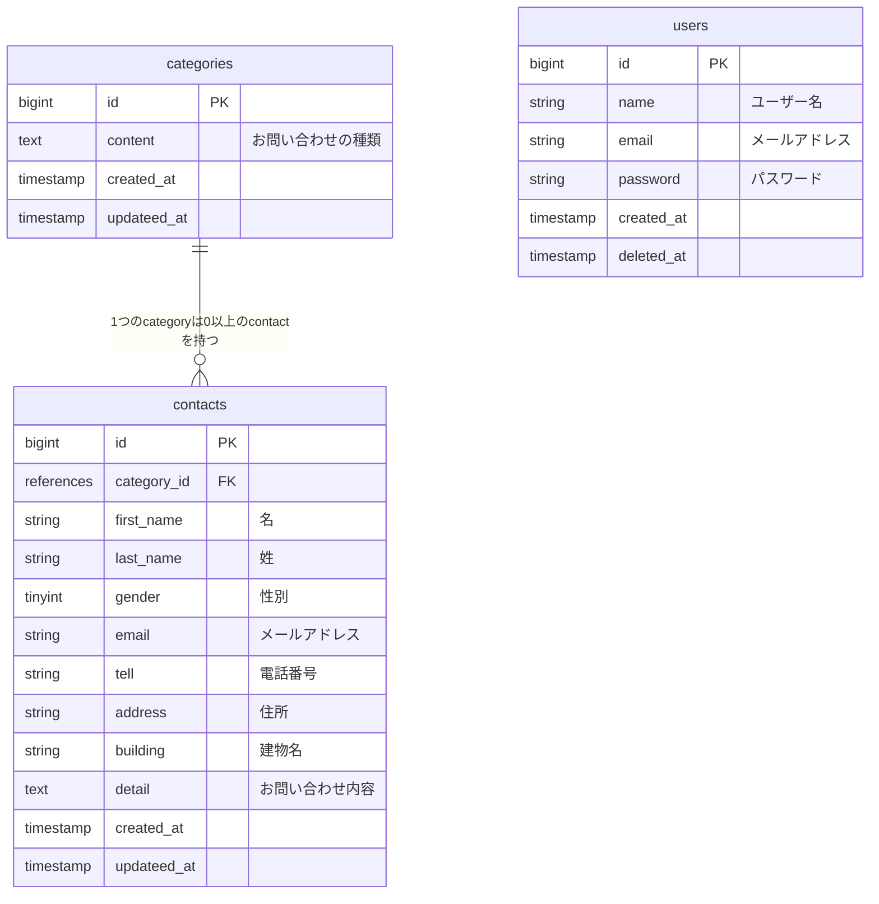

## アプリケーション名
確認テスト：お問合せフォーム

## 環境構築
```
$ git clone
$ docker-compose up -d --build
$ docker-compose exec php bash
> composer install
> cp .env.example .env

# 環境に合わせて下記ファイルを修正ください
> vi .env
> vi docker-compose.yml

> php artisan key:generate
> php artisan migrate
> php artisan db:seed
```

## 使用技術(実行環境)
- PHP 7.4.9
- Laravel 8.83.8 
- MySQL 8.0.26

## ER図


## URL
- 開発環境：http://localhost/
- MySQL管理画面：http://localhost:8080/
